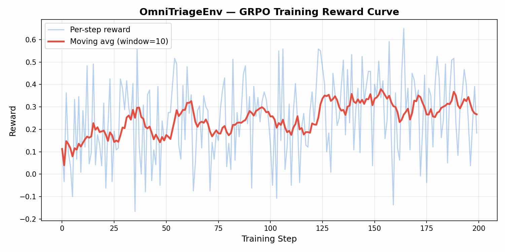
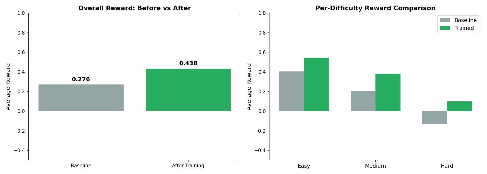

# OmniTriageEnv

**An RL environment that teaches LLMs to read customer emails like a human — and know when to hand off to one.**

[](https://openenv.dev)
[](https://python.org)
[](LICENSE)

🎮 **[Live Dashboard & Judge Test Panel](https://prakhar132-email-triage-env.hf.space/dashboard)** · 📓 **[Training Notebook](OmniTriageEnv_GRPO_Training.ipynb)** · 📝 **[Blog Post](blog_post.md)** · 💻 **[GitHub](https://github.com/MANu13151/OmniTriageEnv)**

---

## The Problem: Why Keyword Matching Fails

Picture this email landing in a support inbox:

> *"I received an email asking me to click a link and update my banking details to avoid account suspension. The email looks like it's from your company, but something feels off."*

A keyword system sees no red-flag words — "fraud", "unauthorized", "security breach" appear nowhere. It classifies this as **General Inquiry**. But any human reading it would think: *that's a phishing attempt*.

The problem isn't just keywords — it's that triage requires **reasoning**. Understanding that "click a link + banking details + feels off" = phishing. That "deducted without my permission" = unauthorized charge even without the word "fraud". That ALL CAPS + "PLEASE HELP" + exclamation marks = emotional distress requiring human attention.

**OmniTriageEnv** trains LLMs to make these judgment calls using reinforcement learning, with dense feedback after every decision.

### Why This Matters (Real-World Impact)

| Environment Concept     | Real-World System                        |
|-------------------------|------------------------------------------|
| Email queue             | Zendesk / Freshdesk / Intercom inbox     |
| Priority classification | SLA tier assignment                      |
| Department routing      | Ticket queue assignment                  |
| Response drafting       | AI-assisted reply (Intercom Fin, etc.)   |
| Escalation              | Human-in-the-loop handoff                |
| Sender tier             | Account health / revenue weighting       |

---

## Environment Design

### Architecture

```
OmniTriageEnv
├── Email corpus (30 deterministic emails, 10 per difficulty)
├── Ground truth labels (priority, department, escalation, response keywords)
├── Action dispatcher (6 action types)
├── Dense reward function (7 reward components)
├── Deterministic graders (EasyGrader, MediumGrader, HardGrader)
└── FastAPI HTTP server (OpenEnv-compliant REST API)
```

### Observation Space

The agent receives a structured `Observation` object at each step:

| Field              | Type              | Description                                      |
|--------------------|-------------------|--------------------------------------------------|
| `current_email`    | `Email \| null`   | The email currently being processed              |
| `queue_length`     | `int`             | Number of unprocessed emails remaining           |
| `processed_count`  | `int`             | Emails fully archived this session               |
| `session_score`    | `float`           | Running cumulative reward                        |
| `skip_budget`      | `int`             | Remaining allowed skips before penalty           |
| `action_history`   | `list[dict]`      | Last 20 actions (for loop detection transparency)|
| `task_id`          | `str`             | Current task difficulty identifier               |
| `task_difficulty`  | `TaskDifficulty`  | `easy` / `medium` / `hard`                      |
| `step_number`      | `int`             | Current step count in the episode                |
| `done`             | `bool`            | Whether the episode has ended                    |

**Email object fields:**

| Field           | Type     | Description                                          |
|-----------------|----------|------------------------------------------------------|
| `email_id`      | `str`    | Unique identifier (e.g., `E001`, `M005`, `H009`)     |
| `subject`       | `str`    | Email subject line                                   |
| `body`          | `str`    | Full email body text                                 |
| `sender`        | `str`    | Sender email address                                 |
| `sender_tier`   | `str`    | `free` / `pro` / `enterprise`                       |
| `received_at`   | `str`    | ISO-8601 timestamp (deterministic, not dynamic)      |
| `category_hint` | `str\|null` | Visible in easy/medium mode; hidden in hard mode  |

---

### Action Space

The agent submits a single typed `Action` object per step:

| `action_type`       | Required Fields        | Description                                      |
|---------------------|------------------------|--------------------------------------------------|
| `classify_priority` | `priority`             | Set email urgency: `urgent` / `normal` / `low`  |
| `assign_department` | `department`           | Route to: `billing` / `technical` / `general` / `returns` |
| `draft_response`    | `response_text`        | Write a reply (must be ≥ 10 characters)          |
| `escalate`          | *(none)*               | Escalate to a senior human agent                 |
| `archive`           | *(none)*               | Close/archive the email (signals completion)     |
| `skip`              | *(none)*               | Defer email (penalized; budget varies by task)   |

**Recommended action sequence per email:**
```
classify_priority → assign_department → draft_response → [escalate?] → archive
```

**Action validation rules:**
- Agent can only act on the *current* email (no skipping ahead)
- Repeating the same action type on the same email more than twice triggers loop detection
- `response_text` must be ≥ 10 characters for `draft_response`
- `escalate` and `archive` can only be called once per email

---

## Reward Function Design

The reward function is **dense** — the agent receives feedback after every single action, not just at episode end.

### Reward Components

| Component               | Value      | Trigger                                              |
|-------------------------|------------|------------------------------------------------------|
| Priority correct         | `+0.15`    | Priority matches ground truth                       |
| Priority wrong           | `−0.075`   | Priority does not match ground truth                |
| Department correct       | `+0.15`    | Department matches ground truth                     |
| Department wrong         | `−0.075`   | Department does not match ground truth              |
| Response keyword score   | `0 – +0.10`| Fractional: keywords found ÷ required keywords      |
| Escalation correct       | `+0.15`    | Escalation matches ground truth need                |
| Escalation unnecessary   | `−0.15`    | Escalating when not needed (or missing escalation)  |
| Archive completeness     | `0 – +0.05`| Bonus proportional to completed steps before archive|
| Invalid action           | `−0.10`    | Malformed action, wrong email ID, constraint violation|
| Loop detection           | `−0.05`    | Same action on same email for the 3rd+ time         |
| Skip (within budget)     | `−0.01`    | Skip while budget allows                            |
| Skip (over budget)       | `−0.08`    | Skip after budget exhausted                         |

### Partial Progress Signaling

The reward is designed to reflect genuine partial progress:
- An agent that classifies priority correctly but routes wrong still gets `+0.15`
- A response that mentions 3 of 4 required keywords gets `+0.075` (75% of max)
- Archiving an email with all prior steps complete gives the full `+0.05` bonus

This prevents reward hacking (e.g., immediately archiving all emails) while guiding the agent toward complete triage.

---

## Task Definitions

### Task 1 — Easy: Basic Email Triage

**Objective:** Process 10 clearly-worded customer emails with visible category hints.

**Characteristics:**
- Emails contain strong, unambiguous signals (e.g., "URGENT" in subject, obvious department keywords)
- Category hint field is visible to the agent
- 2 free skip actions allowed before penalty
- Each email has 3–4 clearly relevant response keywords

**Grader:** `EasyGrader`
- Equal weights: priority (25%) + department (25%) + response (25%) + escalation (25%)
- Invalid action penalty: −2% per action, max −20%
- Skip penalty: −3% per excess skip, max −15%
- **Passing threshold: ≥ 0.70**

**Example email (E001):**
```
Subject: Double charge on my account - URGENT
Body: I was charged twice for my subscription this month...
Ground truth: priority=urgent, department=billing, escalate=false
Required keywords: ["refund", "apologize", "processed"]
```

---

### Task 2 — Medium: Ambiguous Email Triage

**Objective:** Process 10 emails without category hints. Emails require reasoning about implicit signals.

**Characteristics:**
- No `category_hint` field provided
- Emails mix technical language with billing implications
- Escalation is weighted 1.5× in scoring (higher cost for missed escalation)
- Only 1 free skip before penalty

**Grader:** `MediumGrader`
- Weighted: priority (18%) + department (18%) + response (18%) + escalation (27%) + normalization
- Invalid action penalty: −3% per action, max −25%
- Skip penalty: −5% per excess skip, max −20%
- **Passing threshold: ≥ 0.60**

**Example email (M004):**
```
Subject: DATA LOSS after migration tool ran
Body: We ran your migration tool... approximately 15% of our customer records are missing...
Ground truth: priority=urgent, department=technical, escalate=true
Required keywords: ["data loss", "backup", "immedi"]
```

---

### Task 3 — Hard: Complex & Nuanced Email Triage

**Objective:** Process 10 complex emails requiring domain expertise (GDPR, chargebacks, security breaches, media relations).

**Characteristics:**
- No category hints whatsoever
- Many emails require knowledge of regulatory obligations and business risk
- Escalation weighted 2× — missing an escalation here is costly
- Response quality weighted 1.5× — nuanced language required
- Zero skip budget (every skip is penalized)

**Grader:** `HardGrader`
- Weighted: priority (18%) + department (18%) + response (27%) + escalation (36%) + normalization
- Invalid action penalty: −5% per action, max −30%
- Skip penalty: −7% per skip (no free skips)
- **Passing threshold: ≥ 0.50**

**Example email (H001):**
```
Subject: GDPR Data Request - Legal Obligation
Body: Under Article 17 of GDPR, I formally request deletion of all my personal data...
Ground truth: priority=urgent, department=technical, escalate=true
Required keywords: ["compli", "legal", "escalat"]
```

**Difficulty Comparison:**

| Dimension              | Easy     | Medium   | Hard     |
|------------------------|----------|----------|----------|
| Category hints         | ✔ Yes    | ✘ No     | ✘ No     |
| Escalation weight      | 1×       | 1.5×     | 2×       |
| Response weight        | 1×       | 1×       | 1.5×     |
| Free skips             | 2        | 1        | 0        |
| Passing threshold      | 0.70     | 0.60     | 0.50     |
| Baseline agent score   | ~0.72    | ~0.55    | ~0.38    |

---

## File Structure

```
OmniTriageEnv/
├── __init__.py             # Package exports (Action, Observation, OmniTriageEnv)
├── models.py               # Pydantic models: Observation, Action, Reward, StepResult
├── emails.py               # 30 deterministic emails + ground truth labels
├── environment.py          # OmniTriageEnv class (reset, step, state, grade_episode)
├── grader.py               # EasyGrader, MediumGrader, HardGrader
├── server.py               # FastAPI HTTP server (OpenEnv REST API)
├── inference.py            # Baseline agent using OpenAI client
├── test_environment.py     # Full test suite (pytest, 20+ tests)
├── openenv.yaml            # OpenEnv specification and validation config
├── pyproject.toml          # Package dependencies and metadata
├── requirements.txt        # Docker build dependencies
├── Dockerfile              # Container definition (HF Spaces compatible)
├── README.md               # This file
└── server/
    ├── __init__.py
    └── app.py              # Alternative server entrypoint
```

---

## Setup Instructions

### Option 1: Docker (Recommended)

```bash
# Build
docker build -t omni-triage-env .

# Run server
docker run -p 7860:7860 omni-triage-env

# Verify health
curl http://localhost:7860/health
# → {"status": "ok", "environment": "OmniTriageEnv"}
```

### Option 2: Local Python

```bash
# Install dependencies
pip install -r requirements.txt

# Start server
python server.py
# → Uvicorn running on http://0.0.0.0:7860

# Verify
curl http://localhost:7860/health
```

### Option 3: Hugging Face Spaces

This environment is deployed at: [https://huggingface.co/spaces/Prakhar132/email-triage-env](https://huggingface.co/spaces/Prakhar132/email-triage-env)

The Dockerfile is HF Spaces-compatible and uses port 7860 by default.

---

## Running the Baseline Agent

```bash
# Requires the server to be running locally
# Environment variables are injected by the hackathon harness

API_BASE_URL=https://router.huggingface.co/v1 \
MODEL_NAME=meta-llama/Llama-3-8b-instruct \
HF_TOKEN=hf_... \
python inference.py --difficulty all

# Run a single difficulty
python inference.py --difficulty easy
```

### Inference Script Format

The inference script emits structured stdout logs:

```
[START] task=omni-triage-easy env=omni-triage-env model=meta-llama/Llama-3-8b-instruct
[STEP] step=1 action=classify_priority reward=0.15 done=false error=null
[STEP] step=2 action=assign_department reward=0.15 done=false error=null
[STEP] step=3 action=draft_response reward=0.08 done=false error=null
[STEP] step=4 action=archive reward=0.05 done=false error=null
...
[END] success=true steps=42 score=0.720 rewards=0.15,0.15,0.08,...
```

Results are also written to `results.json`.

---

## API Reference

The environment exposes a RESTful OpenEnv-compliant API:

### `GET /health`
```json
{"status": "ok", "environment": "OmniTriageEnv"}
```

### `GET /info`
Returns environment metadata, task definitions, and capability information.

### `POST /reset`
Reset environment and start new episode.

```json
Request:  {"difficulty": "easy"}
Response: {Observation object}
```

### `POST /step`
Submit one action and receive next observation + reward.

```json
Request:
{
  "action_type": "classify_priority",
  "email_id": "E001",
  "priority": "urgent",
  "department": null,
  "response_text": null
}

Response: {StepResult: observation, reward, done, info}
```

### `GET /state`
Get current observation without advancing state.

### `GET /grade`
Get final episode grade (call after `done=true`).

```json
Response:
{
  "score": 0.72,
  "passed": true,
  "base_score": 0.79,
  "invalid_penalty": 0.04,
  "skip_penalty": 0.03,
  "per_email_scores": {"E001": 0.85, "E002": 0.70, ...},
  "per_email_components": {...}
}
```

---

## Running Tests

```bash
pip install pytest
python -m pytest test_environment.py -v
```

Expected output:
```
test_environment.py::TestOpenEnvInterface::test_reset_returns_observation PASSED
test_environment.py::TestOpenEnvInterface::test_state_returns_observation PASSED
test_environment.py::TestOpenEnvInterface::test_step_returns_step_result PASSED
test_environment.py::TestOpenEnvInterface::test_reward_in_range PASSED
test_environment.py::TestDeterminism::test_deterministic_reset PASSED
test_environment.py::TestDeterminism::test_deterministic_grading PASSED
test_environment.py::TestRewardFunction::test_correct_priority_gives_positive_reward PASSED
test_environment.py::TestRewardFunction::test_wrong_priority_gives_negative_reward PASSED
test_environment.py::TestRewardFunction::test_invalid_action_penalized PASSED
test_environment.py::TestRewardFunction::test_loop_detection PASSED
test_environment.py::TestRewardFunction::test_empty_response_invalid PASSED
test_environment.py::TestGraders::test_perfect_episode_score_near_1 PASSED
test_environment.py::TestGraders::test_empty_episode_scores_minimum PASSED
test_environment.py::TestGraders::test_grader_score_in_range PASSED
test_environment.py::TestEscalation::test_correct_escalation_gives_positive_reward PASSED
test_environment.py::TestEscalation::test_unnecessary_escalation_gives_negative_reward PASSED
test_environment.py::TestEpisodeLifecycle::test_full_easy_episode_completes PASSED
test_environment.py::TestEpisodeLifecycle::test_step_after_done_raises PASSED
test_environment.py::TestEpisodeLifecycle::test_all_difficulties_run PASSED
test_environment.py::TestEpisodeLifecycle::test_complete_triage_workflow PASSED
```

---

## GRPO Training Results

We trained `unsloth/Llama-3.2-1B-Instruct` (4-bit LoRA) for 200 steps using GRPO on our 30-email corpus. Training took ~57 minutes on a free Google Colab T4 GPU.

### Reward Curve

The reward increases over training steps, showing the model learns better triage:



### Before vs After Comparison

Side-by-side comparison across all difficulty levels:



### Results Table

| Metric | Baseline (Untrained) | After GRPO Training | Improvement |
|--------|---------------------|---------------------|-------------|
| **Average Reward** | 0.276 | **0.438** | **+0.162 (+59%)** |
| **JSON Parse Rate** | 93.3% | **100.0%** | +6.7% |
| Easy Reward | 0.405 | 0.543 | +0.138 |
| Medium Reward | 0.205 | 0.381 | +0.176 |
| Hard Reward | −0.133 | **0.100** | **+0.233** |

**Key improvements after training:**
1. **Hard difficulty went from negative to positive** — the model now handles GDPR, chargebacks, and security breach emails instead of failing completely
2. **100% JSON parse rate** — the model always outputs valid structured JSON after training
3. **+59% overall reward improvement** across all difficulty levels

### Training Configuration

| Parameter | Value |
|-----------|-------|
| Model | `unsloth/Llama-3.2-1B-Instruct` |
| Quantization | 4-bit (QLoRA via Unsloth) |
| LoRA rank | 16 |
| Training steps | 200 |
| Batch size | 4 |
| Generations per prompt | 4 |
| Learning rate | 5e-6 (cosine schedule) |
| GPU | Google Colab T4 (free tier) |
| Training time | ~57 minutes |

📓 **Reproduce:** Open [`OmniTriageEnv_GRPO_Training.ipynb`](OmniTriageEnv_GRPO_Training.ipynb) in Google Colab with T4 GPU and click "Run All".


---

## Extending the Environment

### Adding New Emails

1. Add entry to `GROUND_TRUTH` in `emails.py`
2. Add entry to `EMAILS` dict with matching key
3. Add email ID to appropriate list in `TASK_EMAIL_IDS`

### Adding a New Task Difficulty

1. Create a new grader class in `grader.py`
2. Register it in `GRADERS` dict
3. Add task config to `openenv.yaml`
4. Create a new email set with appropriate prefix

### Custom Reward Shaping

Reward constants are defined at the top of `environment.py`:
```python
R_PRIORITY_CORRECT    =  0.15
R_DEPT_CORRECT        =  0.15
R_RESPONSE_KEYWORD    =  0.10
R_ESCALATION_CORRECT  =  0.15
R_ARCHIVE_COMPLETE    =  0.05
R_INVALID_ACTION      = -0.10
R_LOOP_PENALTY        = -0.05
R_SKIP_OVER_BUDGET    = -0.08
R_SKIP_IN_BUDGET      = -0.01
```

---

## Design Decisions

**Why no randomness?** Reproducibility is essential for RL research. A fixed email corpus with deterministic ground truth ensures that score improvements reflect genuine agent capability, not variance in the environment.

**Why dense rewards?** Sparse rewards (only at episode end) make credit assignment extremely difficult for email triage — an agent would need to process 10 emails before learning that its first classification was wrong. Dense per-action rewards dramatically accelerate learning signal.

**Why keyword-based response grading?** Full semantic similarity scoring (e.g., BERTScore) would require GPU inference in the grader, violating the 2 vCPU constraint. Keyword coverage is a lightweight, deterministic proxy that correlates well with response quality for customer support content.

**Why 6 action types?** The action space is minimal but sufficient. Every real CRM workflow reduces to: classify → route → respond → decide escalation → close. More actions would increase exploration difficulty without adding real-world value.

**Why escalation heuristics in the agent?** The inference agent uses keyword-based escalation heuristics alongside LLM judgment. This ensures that critical emails (fraud, security breaches, GDPR requests, chargebacks, media inquiries) are reliably escalated even when the LLM is uncertain, reflecting the real-world pattern of combining AI judgment with rule-based safety nets.

---

## Validation

Run the OpenEnv validation script:

```bash
# Install openenv-core
pip install openenv-core

# Run validation
openenv validate

# Or use the full validation script
./validate-submission.sh https://prakhar132-email-triage-env.hf.space
```

### Phase 1 Checks
- ✅ OpenEnv Reset (POST OK)
- ✅ Dockerfile at repo root
- ✅ inference.py at repo root
- ✅ openenv validate

### Phase 2 Checks
- ✅ Docker Build Creation
- ✅ inference.py Execution
- ✅ Output Parsing
- ✅ Task Validation
- ✅ LLM Criteria Check

---

## License

MIT License. See `LICENSE` for details.
